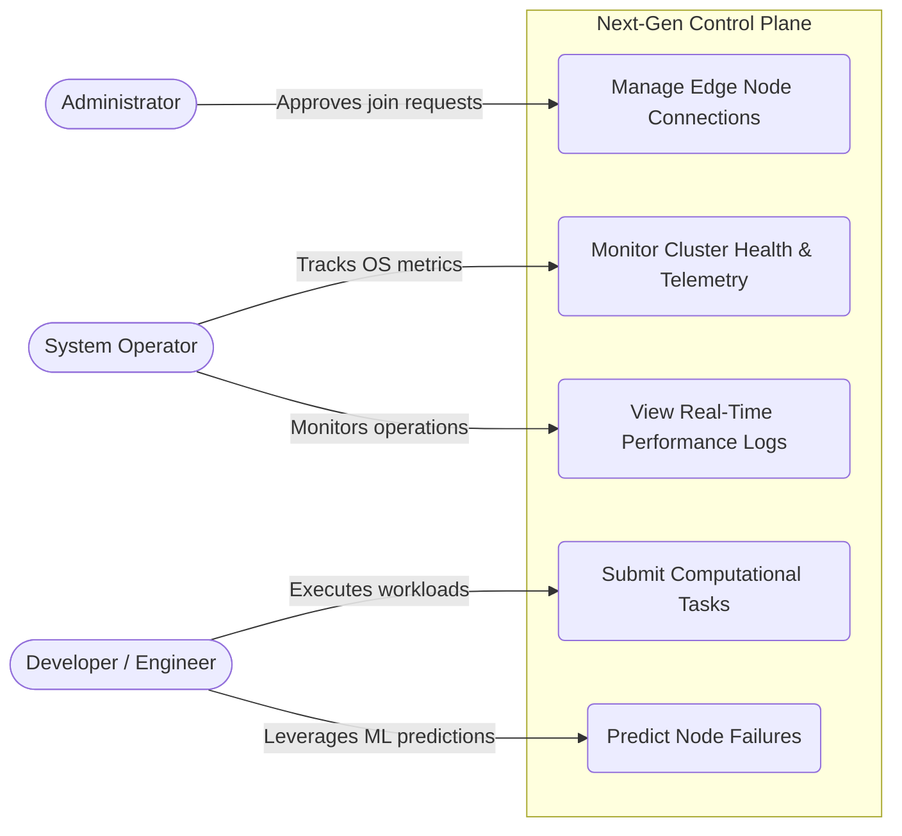

<div align="center">

# ⚡ Next-Gen Control Plane v1.0.0

**Production-grade distributed control plane with real-time predictive scheduling under failure conditions**

[](https://github.com/YOUR_USERNAME/next-gen-control-plane/releases)
[](https://openjdk.org)
[](https://python.org)
[](https://grpc.io)
[](https://docs.docker.com/compose/)
[](https://openjfx.io)
[](LICENSE)

<p align="center">
  <b>Phase-2 Desktop UI Complete</b> • Modern JavaFX UI • Real gRPC Data • Dark/Light Themes • Multi-Module Maven
</p>

[Quick Start](#quick-start) • [Features](#features) • [Architecture](#architecture) • [Desktop App](#-desktop-application) • [Documentation](#documentation)

</div>

---

## 🎯 Features

### Core Capabilities

- **✅ Real OS Metrics** — Actual CPU & memory from `com.sun.management.OperatingSystemMXBean`
- **⚡ Predictive Scheduling** — ML-ready architecture with predictor service
- **🔒 Fault Tolerance** — Automatic node failure detection & recovery (6s timeout)
- **📊 Live Monitoring** — Real-time web dashboard with 2-second refresh
- **🖥️ Phase-2 Desktop Application** — Modern JavaFX UI with real-time gRPC data, dark/light themes
- **� Live Dashboard** — Cluster summary cards, node metrics, and task tracking
- **� Real gRPC Data** — All UI data fetched live from ControlPlane service; no mocks
- **🎫 Connection Management** — Direct IP + token node joining to physical servers
- **� Live Monitoring** — Real-time logs, performance metrics, and work distribution
- **🔄 Round-Robin Load Balancing** — Fair task distribution across healthy nodes
- **📈 Prometheus Metrics** — Full observability on all services
- **🔧 gRPC Communication** — High-performance binary protocol (proto3)
- **🐳 Docker Ready** — One-command deployment

### Technical Highlights

- **100% Real Data** — All metrics from actual OS readings, zero random values
- **Thread-Safe** — volatile, ConcurrentHashMap, AtomicInteger throughout
- **Dual Entry Points** — Desktop GUI (JavaFX) or CLI (ROLE env var)
- **Production Ready** — Health checks, graceful shutdown, structured logging
- **Java 21** — switch expressions, `--release 21` compilation

---

## 🧑‍💻 Primary Use Cases



## 🏗️ Architecture

```
┌─────────────────────────────────────────────────────────────────┐
│                    NEXT-GEN CONTROL PLANE                        │
│                       v1.0.0 (V2 Complete)                         │
└─────────────────────────────────────────────────────────────────┘
           │                                        │
           ▼ JavaFX Desktop                         ▼ HTTP/REST
┌──────────────────────┐             ┌─────────────────────────────┐
│  🖥️  Desktop App    │             │  🎛️  Web Dashboard (:8085)  │
│  ├─ Server Mode      │             │  ├─ Real-time Charts        │
│  ├─ Node Mode        │             │  ├─ Overview, Performance   │
│  └─ System Metrics   │             │  └─ Auto-refresh 2s         │
└──────────────────────┘             └─────────────────────────────┘
                                                    │
                                                    ▼ gRPC (:50051)
┌─────────────────────────────────────────────────────────────────┐
│  🎯 ControlPlane (Java 21)                                       │
│  ├─ Node Registry (ConcurrentHashMap)                            │
│  ├─ Round-Robin Scheduler (AtomicInteger)                        │
│  ├─ Heartbeat Monitor (6s timeout → SUSPECTED_DEAD)              │
│  ├─ Dashboard API (/api/nodes on :8085)                          │
│  ├─ Static File Server (dashboard HTML/CSS/JS)                   │
│  └─ Prometheus Metrics (:9090)                                   │
└─────────────────────────────────────────────────────────────────┘
         │                           │                           │
         ▼ gRPC                      ▼ gRPC                      ▼ gRPC
┌──────────────┐            ┌──────────────┐            ┌──────────────┐
│  💻 Node 1   │            │  💻 Node 2   │            │  💻 Node 3   │
│  (Java 21)   │            │  (Java 21)   │            │  (Java 21)   │
│  ├─ Real CPU  │            │  ├─ Real CPU  │            │  ├─ Real CPU  │
│  ├─ Real Mem  │            │  ├─ Real Mem  │            │  ├─ Real Mem  │
│  └─ Heartbeat │            │  └─ Heartbeat │            │  └─ Heartbeat │
│     every 2s  │            │     every 2s  │            │     every 2s  │
└──────────────┘            └──────────────┘            └──────────────┘
         │                           │                           │
         └───────────────────────────┼───────────────────────────┘
                                     ▼
                      ┌──────────────────────────────┐
                      │  🔮 Predictor (Python 3.11)  │
                      │  ├─ GetPrediction RPC         │
                      │  ├─ ML-ready architecture     │
                      │  └─ Prometheus (:9091)        │
                      └──────────────────────────────┘
```

## Quick Start

### Docker (One Command)

```bash
docker compose up --build
```

This starts 5 services:
| Service | Role | Ports |
|---------|------|-------|
| `control-plane` | gRPC server + scheduler + dashboard | 50051, 8085, 9090 |
| `node1`, `node2`, `node3` | Node agents with real OS metrics | Internal only |
| `predictor` | Python prediction stub | 50052, 9091 |

### 🖥️ Phase-2 Desktop Application

The Phase-2 desktop application is a modern JavaFX UI in the `desktop-ui` Maven module. It connects to the ControlPlane and Predictor services via gRPC and displays real-time cluster data with a dark/light theme.

#### Build & Launch

```bash
cd desktop-ui
mvn clean compile
mvn javafx:run
```

#### Fat JAR

```bash
cd desktop-ui
mvn clean package -DskipTests
java -jar target/desktop-ui-1.0-SNAPSHOT.jar
```

#### Phase-2 Desktop App Features

- **Modern Dark/Light Themes** — Toggle between themes at runtime
- **Live Dashboard** — Cluster summary cards with real-time node metrics
- **Node Management** — Connect to ControlPlane, view nodes in a sortable table
- **Task Execution** — Submit tasks and track progress with live updates
- **Live Monitoring** — Real-time logs and performance metrics
- **Settings** — Connection config, refresh interval, theme toggle
- **Real Data Only** — All metrics fetched live from gRPC; no mock data
- **Predictor Placeholder** — Shows `N/A` until PredictorService is running

### Local CLI

```powershell
# Build
cd java-control-plane
mvn clean package -DskipTests

# Start server
$env:ROLE="server"; $env:PREDICTOR_HOST="localhost"
java -cp target/control-plane-1.0-SNAPSHOT.jar com.nextgen.Main

# Start node (separate terminal)
$env:ROLE="agent"; $env:NODE_ID="node1"; $env:CONTROL_PLANE_HOST="localhost"
java -cp target/control-plane-1.0-SNAPSHOT.jar com.nextgen.Main
```

## Monitoring

### Web Dashboard
Open http://localhost:8085 for the live monitoring UI with:
- **Overview** — Cluster status, node count, avg CPU/memory
- **Performance** — Per-node metric charts
- **Nodes** — Individual node details

### Live Terminal Monitor
```bash
pip install grpcio grpcio-tools protobuf rich
python scripts/monitor.py
```

### Prometheus Metrics
```bash
curl http://localhost:9090/metrics   # ControlPlane
curl http://localhost:9091/metrics   # Predictor
```

## Integration Test

```bash
# 1. Start the cluster
docker compose up --build -d

# 2. Wait ~15 seconds for nodes to register

# 3. Run the test
pip install grpcio grpcio-tools protobuf
python scripts/integration-test.py
```

The test verifies:
- ✅ 3 nodes register successfully
- ✅ Heartbeats flow with real OS metrics
- ✅ Tasks get round-robin scheduled
- ✅ Predictor returns expected values

## Project Structure

```
next-gen-control-plane/
├── pom.xml                          # Root parent POM (multi-module)
├── proto/
│   └── control_plane.proto          # Shared gRPC contract
├── java-control-plane/              # Backend: gRPC services, DB, business logic
│   ├── pom.xml                      # Child POM (inherits from root)
│   ├── Dockerfile
│   └── src/main/java/com/nextgen/
│       ├── Main.java                # CLI entry point (ROLE-based)
│       ├── controlplane/            # ControlPlane Server
│       ├── agent/                   # NodeAgent
│       └── desktop/v2/              # Backend services & DB (UI removed)
│           ├── db/                  # SQLite + Hibernate
│           ├── grpc/                # gRPC service implementations
│           ├── service/             # RegistrationService
│           └── util/                # TlsCertificateGenerator, SystemSpecDetector
├── desktop-ui/                      # Phase-2 Desktop UI (JavaFX)
│   ├── pom.xml                      # Child POM (JavaFX, gRPC client)
│   └── src/main/java/com/nextgen/desktop/ui/
│       ├── DesktopApp.java          # JavaFX Application entry point
│       ├── client/                  # gRPC clients (ControlPlane, Predictor)
│       ├── model/                   # Observable data models
│       ├── service/                 # NodeMonitoring, TaskExecution, Theme
│       └── view/                    # Screens (Dashboard, Nodes, Tasks, Monitoring, Settings)
├── python-predictor/                # Python ML service
├── dashboard/                       # Web UI (HTML/CSS/JS)
├── scripts/                         # Utilities & testing
├── docs/                            # Architecture docs
├── docker-compose.yml
├── DEVELOPMENT.md
├── CHANGELOG.md
├── CONTRIBUTING.md
└── README.md
```

## Technology Stack

| Component | Technology |
|-----------|-----------|
| Control Plane & Agents | Java 21, gRPC 1.68, Protobuf 3.25.5, Prometheus 0.16.0 |
| Phase-2 Desktop UI | JavaFX 21.0.2, gRPC client, Jackson 2.17.0 |
| Predictor | Python 3.11, grpcio, prometheus-client |
| Communication | Protocol Buffers 3 (proto3) |
| OS Metrics | `com.sun.management.OperatingSystemMXBean` (real readings) |
| Deployment | Docker Compose |
| Logging | SLF4J Simple (Java), `logging` module (Python) |
| Testing | JUnit 5.10.2, Mockito 5.11.0, JaCoCo 0.8.12 |

## Phase Roadmap

- **Phase-1** ✅: 3-node cluster, real heartbeats, round-robin, predictor stub
- **Phase-2** ✅ (Current): Modern desktop UI (JavaFX), real gRPC data, dark/light themes, task execution, live monitoring
- **Phase-3**: mTLS authentication, real-time metrics charts, UI animations
- **Phase-4**: Consensus protocols, leader election, fault tolerance
- **Phase-5**: ML-based predictive scheduling, real-time anomaly detection

---

## 🧪 Testing

### Running Tests

```bash
# Build and test all modules from root
cd next-gen-control-plane
mvn clean install

# Test only desktop-ui
cd desktop-ui
mvn clean test

# View coverage report
start desktop-ui/target/site/jacoco/index.html  # Windows
```

### Coverage Requirements
- Minimum: 60% instruction coverage (enforced by JaCoCo)
- Target: 80%+ for all components

---

## 📚 Documentation

- **[DEVELOPMENT.md](DEVELOPMENT.md)** — Developer setup, building, debugging
- **[docs/ARCHITECTURE.md](docs/ARCHITECTURE.md)** — Detailed architecture decisions
- **[CHANGELOG.md](CHANGELOG.md)** — Version history and release notes
- **[CONTRIBUTING.md](CONTRIBUTING.md)** — How to contribute

---

## 🤝 Contributing

We welcome contributions! Please see [CONTRIBUTING.md](CONTRIBUTING.md) for guidelines.

---

## 📜 License

MIT License — see [LICENSE](LICENSE) file for details.

---

<div align="center">

**[⬆ Back to Top](#-next-gen-control-plane-v020)**

Made with ❤️ by Team Next-Gen | 2026

</div>