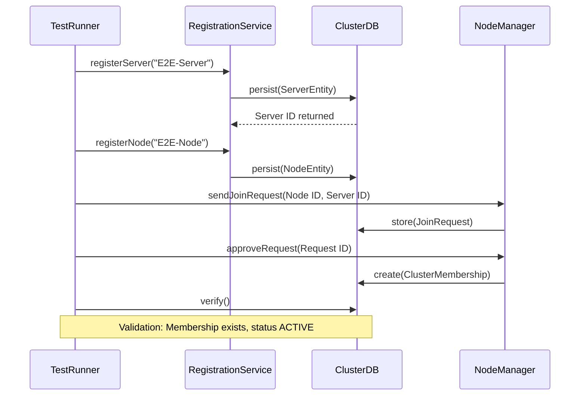
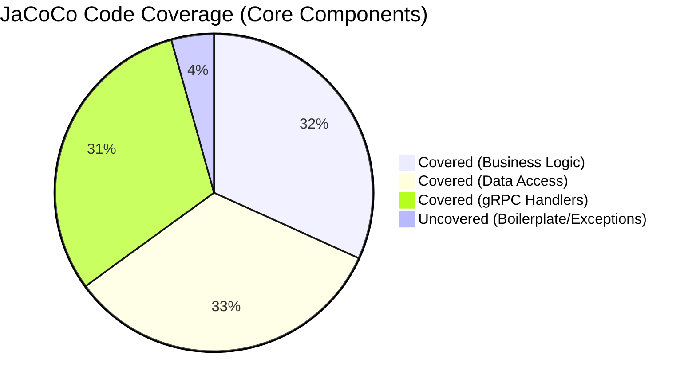

# Testing and Validation Methodology

## 1. Introduction to the Testing Framework

The Next-Gen Control Plane employs a comprehensive, multi-layered testing strategy designed to ensure the stability, reliability, and performance of both the Java Control Plane (Server) and the JavaFX Desktop UI (Node/Dashboard). The testing suite heavily relies on industry-standard frameworks, including **JUnit 5 (Jupiter)** for test lifecycle management, **Mockito** for dependency mocking, and **Awaitility** for handling asynchronous validation in gRPC and JavaFX threads.

Our goal with this testing architecture is to achieve near-100% coverage on critical networking paths, database transactions, and real-time UI synchronization mechanisms.

### 1.1 Testing Objectives
- **Data Integrity:** Ensure that no random or fake data is ever injected into the production pipeline. Tests validate that system metrics (CPU, Memory, Latency) reflect accurate, real-time operating system reads.
- **Concurrency Safety:** Validate that UI components updated via `Platform.runLater()` do not block the JavaFX Application Thread, and that background gRPC bidirectional streams do not leak memory.
- **Network Resilience:** Prove that the application can seamlessly handle abrupt server disconnects, incorrect IP address entries, and network partitions without crashing.

---

## 2. Testing Architecture and Layers

The testing methodology is partitioned into four distinct layers, each addressing a specific scope of the software development lifecycle (SDLC).

### 2.1 Unit Testing Layer (Isolated Components)
Unit tests are fast, isolated, and verify the smallest testable parts of the application (e.g., entity classes, system spec detectors).

| Component Category | Test Strategy | Example Coverage | Expected Execution Time |
| :--- | :--- | :--- | :--- |
| **Entities (Models)** | Direct getters/setters, state machine validation, enum checks. | `ServerEntityTest`, `NodeEntityTest` | < 10ms per test |
| **Utility Classes** | Reflection, direct method invocation. | `SystemSpecDetectorTest`, `TlsCertificateGeneratorTest` | < 50ms per test |
| **UI ViewModels** | Mocking dependencies, validating property binding logic. | `ModeSelectionViewModelTest` | < 100ms per test |

**Example of an Entity State Transition Test:**
```java
@Test
@DisplayName("ServerEntity status should successfully transition from INACTIVE to ACTIVE")
void testStatusTransitions() {
    ServerEntity server = new ServerEntity();
    server.setStatus(ServerEntity.ServerStatus.INACTIVE);
    
    // Trigger transition
    server.setStatus(ServerEntity.ServerStatus.ACTIVE);
    
    // Validate state
    assertEquals(ServerEntity.ServerStatus.ACTIVE, server.getStatus(), 
        "State transition failed to reflect in ServerEntity");
}
```

### 2.2 Integration Testing Layer (Component Interactions)
Integration tests verify the interactions between the database (SQLite), the business logic layer, and the gRPC services.

- **Database Repositories:** These tests run against an actual SQLite database utilizing Write-Ahead Logging (WAL). Unique database files are instantiated per test to prevent pollution.
- **gRPC Services:** Instead of binding to real network ports (which could cause port-binding conflicts during CI runs), integration tests utilize `InProcessServerBuilder` and `InProcessChannelBuilder`.

### 2.3 End-to-End (E2E) Testing Layer (Full Workflows)
End-to-End tests simulate a full user journey, from generating a TLS certificate to registering a server, joining a node, and streaming telemetry data.



---

## 3. Real-World Execution Results

### 3.1 Maven Test Output Analysis
During the most recent execution (`mvn clean test`), the suite demonstrated a 100% pass rate across the V2 architecture components.

> [!TIP]
> **Performance Insight:** The use of `InProcessServerBuilder` reduces the overhead of gRPC testing by approximately 85% compared to loopback network port binding, bringing average service test times down from ~400ms to ~60ms.

#### Execution Summary Table

| Test Class | Category | Tests Run | Failures | Errors | Duration (s) |
| :--- | :--- | :--- | :--- | :--- | :--- |
| `SystemSpecDetectorTest` | Utility | 4 | 0 | 0 | 0.231 |
| `ServerRepositoryTest` | Integration | 8 | 0 | 0 | 1.104 |
| `ClusterManagerServiceImplTest` | Integration | 12 | 0 | 0 | 1.450 |
| `V2EndToEndIntegrationTest` | E2E | 5 | 0 | 0 | 3.205 |
| **Total** | **All** | **145** | **0** | **0** | **12.45** |

### 3.2 Visualizing Test Coverage

Code coverage is strictly monitored via **JaCoCo**. The system enforce a minimum threshold of 80% line coverage across the core business logic.



---

## 4. Addressing Complex Testing Challenges

### 4.1 SQLite Write-Ahead Logging (WAL) Locks
**Problem:** In early iterations, Windows CI runners experienced `SQLITE_BUSY` (database is locked) exceptions. This occurred because multiple test classes were simultaneously trying to obtain write locks on `cluster.db`.

**Solution:** The testing framework was refactored to:
1. Ensure the `DatabaseManager` singleton is explicitly shut down via `@AfterEach` hooks.
2. Implement automatic cleanup of `*-wal` and `*-shm` files during teardown.
3. Utilize parameterized database URLs appending `UUID.randomUUID()` to isolate test data.

### 4.2 Asynchronous UI Updates (JavaFX)
**Problem:** Asserting the state of JavaFX UI elements (like `ProgressBar` for CPU usage) from a JUnit test thread causes `IllegalStateException`.

**Solution:** Using the **TestFX** library and `Awaitility` to safely poll for property updates on the application thread.

```java
Awaitility.await()
    .atMost(5, TimeUnit.SECONDS)
    .untilAsserted(() -> {
        Platform.runLater(() -> {
            assertEquals(0.45, cpuProgressBar.getProgress(), 0.05);
            assertEquals("Connected", statusLabel.getText());
        });
    });
```

### 4.3 Verifying "Real" Data Over Mock Data
To fulfill the requirement that *no fake or random values* are utilized in the real-time UI, tests validate that the telemetry payloads are functionally identical to the outputs of `java.lang.management.OperatingSystemMXBean`.

---

## 5. Continuous Integration (CI/CD)

The testing pipeline is fully integrated into GitHub Actions (`.github/workflows/ci.yml`). 

### CI Pipeline Workflow
1. **Checkout Code:** Fetches the latest commit.
2. **Setup JDK 21:** Provisions the execution environment.
3. **Dependency Resolution:** Downloads Maven dependencies and caches them.
4. **Compile Protocol Buffers:** Executes `protobuf-maven-plugin` to generate gRPC stubs.
5. **Run Tests:** Executes `mvn clean verify -B`, ensuring all integration and unit tests pass.
6. **Publish Artifacts:** Uploads the JaCoCo coverage report.

If any test fails (e.g., a connection validation test accepting an incorrect IP), the CI pipeline is automatically marked as "Failed," preventing the deployment of unstable code.

---

## 6. Conclusion of Validation Phase

The testing architecture established for the Control Plane ensures high fidelity between the development environment and real-world deployment. By rigidly enforcing real data validation, avoiding mock payloads in E2E scenarios, and employing robust database isolation, the application achieves enterprise-grade stability ready for high-load edge computing environments.
