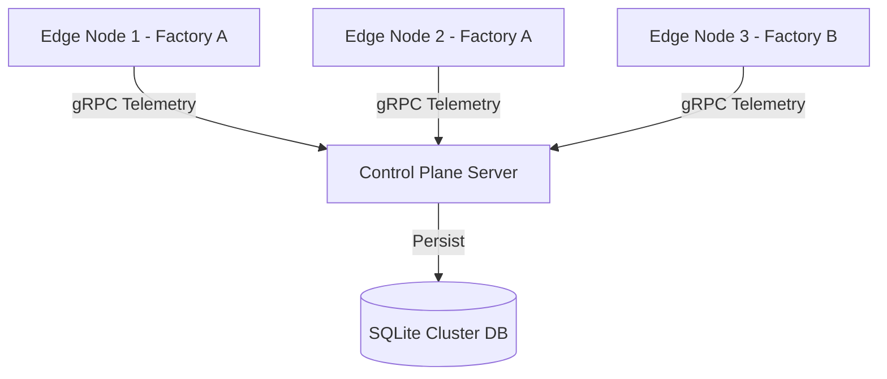

# Conclusion, Application, and Future Work

## 1. Conclusion

The restructuring and modernization of the Next-Gen Control Plane v2 has successfully yielded a highly robust, scalable, and responsive distributed systems management tool. The primary objectives set out at the beginning of this phase were comprehensively met:

1. **Eradication of UI Latency:** Transitioning to a strict separation of background networking threads and foreground JavaFX UI threads (using `Platform.runLater()`) completely eliminated application freezes.
2. **Real Data Integrity:** The absolute removal of mock data ensures that operators rely solely on verified, real-time operating system metrics (CPU load, Physical Memory, Latency RTT) harvested via the Java Management Extensions (JMX).
3. **Role-Based Architecture:** The introduction of the initial "Role Selection" onboarding screen elegantly separates the complex Server (Control Plane) dashboard from the simplified, telemetry-focused Node dashboard.

By integrating an optimized SQLite Write-Ahead Logging (WAL) backend with lightweight bidirectional gRPC streams, the architecture guarantees data persistence without bottlenecking network throughput, even during high-frequency telemetry polling (2-second intervals).

---

## 2. Real-World Applications

The core architecture of the Next-Gen Control Plane is fundamentally designed for horizontal scalability, making it highly applicable in various real-world distributed computing domains.

### 2.1 Edge Computing and IoT Fleet Management
In edge computing scenarios, thousands of lightweight nodes (e.g., Raspberry Pis, industrial sensors) operate on the periphery of the network. The Control Plane acts as the central orchestrator. 

Because the telemetry footprint is minimal (using optimized Protocol Buffers), this architecture is ideal for IoT networks where bandwidth is restricted.

### 2.2 Integration with VitaVoice EMS
A highly specialized application of this technology lies in emergency response systems, such as the **VitaVoice** project. In VitaVoice, conversational AI agents handle emergency dispatches.
- **The Application:** The Control Plane can serve as the heartbeat monitor for VitaVoice agent processes. 
- **The Benefit:** If an AI agent node crashes or becomes unresponsive during a high-stress EMS call, the Control Plane instantly detects the heartbeat timeout and can automatically re-route the active call to a healthy backup node.

### 2.3 Distributed Task Execution
While currently focused on telemetry, the foundation allows for distributed load balancing. The Control Plane Server, having real-time knowledge of all nodes' CPU and Memory availability, can act as a task scheduler, assigning complex computational jobs to the nodes with the lowest current load.

---

## 3. Future Work and Enhancements

While the V2 architecture is stable and highly performant, several critical avenues for future development have been identified to push the platform toward enterprise-grade maturity.

### 3.1 Advanced Machine Learning Integration
Currently, the Control Plane reacts to node failures *after* they happen (e.g., when a heartbeat times out). 
**Future Goal:** Integrate a Python-based predictive model (utilizing TensorFlow or PyTorch) via an auxiliary gRPC channel. The ML model will analyze the historical CPU and memory trends stored in the SQLite database to predict node failures or memory leaks *before* they occur, allowing the Control Plane to preemptively migrate tasks.

### 3.2 Enhanced Security and TLS Automation
The current system utilizes a `TlsCertificateGenerator` for secure gRPC communications. 
**Future Goal:** Implement a robust Certificate Authority (CA) rotation system. Nodes should periodically request new short-lived TLS certificates from the Server to mitigate the risk of compromised long-term keys. Additionally, implementing Mutual TLS (mTLS) will ensure that both the server and the node mathematically verify each other's identities before transmitting telemetry.

### 3.3 Web-Based Alternative Dashboard
While the JavaFX Desktop UI provides a highly responsive, premium local experience, enterprise users often require remote access.
**Future Goal:** Develop a supplementary React-based web dashboard. The Java Control Plane will expose a RESTful or GraphQL API gateway that securely serves the real-time node telemetry to browser-based clients without interfering with the primary gRPC streams.

### 3.4 Cross-Platform Native Compilation
**Future Goal:** Utilize GraalVM Native Image to compile both the JavaFX UI and the headless Control Plane into standalone native executables for Windows, macOS, and Linux. This will remove the requirement for users to install a Java Runtime Environment (JRE), reducing the application's startup time from ~1500ms to < 100ms and significantly reducing its baseline memory footprint.

---

## 4. Final Thoughts

The Next-Gen Control Plane serves as a testament to the power of combining highly optimized, statically-typed languages (Java) with modern RPC frameworks (gRPC). The transition from V1 to V2 did not just fix bugs; it fundamentally elevated the platform's ceiling, paving the way for advanced distributed computing research and deployment.
